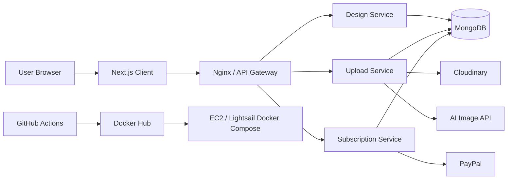

# Aakaar - Canva Clone

Aakaar is a full-stack Canva-style design editor built with a Next.js frontend and Node.js backend microservices. It supports canvas-based editing, project persistence, image uploads, AI image generation, authentication, and a Docker-based backend deployment workflow.

## Project Overview

This project demonstrates a production-style full-stack architecture for an online design editor. The frontend provides the editor, dashboard, authentication flow, and subscription UI. The backend is split into focused services behind an API gateway and Nginx reverse proxy.

## Features

- Canva-like editor with shapes, text, images, drawing tools, and object controls
- Design dashboard with create, load, update, and delete workflows
- Auto-save support for design data
- Image upload flow using Cloudinary
- AI image generation integration
- Export designs as PNG, JPG, SVG, and JSON
- Google authentication support
- Premium/subscription flow with PayPal integration
- Dockerized backend services for local and cloud deployment
- CI/CD pipeline that builds Docker images, pushes to Docker Hub, and deploys to EC2/Lightsail

## Tech Stack

- **Frontend:** Next.js App Router, React, TailwindCSS, Shadcn UI
- **Canvas:** Fabric.js
- **State Management:** Zustand
- **Authentication:** Auth.js / NextAuth v5, Google OAuth
- **Backend:** Node.js, Express, API Gateway, microservices
- **Database:** MongoDB / MongoDB Atlas
- **Storage:** Cloudinary
- **Payments:** PayPal subscriptions
- **DevOps:** Docker, Docker Compose, Nginx, GitHub Actions, Docker Hub, EC2/Lightsail

## Architecture Diagram



## System Architecture Overview

Aakaar follows a split frontend/backend architecture. The Next.js client handles the user interface, editor experience, authentication screens, and dashboard. Backend traffic goes through Nginx and the API Gateway, which routes requests to dedicated services for design data, media uploads, and subscriptions.

The design and upload services persist application data in MongoDB. The upload service also integrates with Cloudinary for asset storage and an external AI image API for image generation. The subscription service is designed for PayPal billing workflows. In production, the backend services run as Docker containers on EC2/Lightsail and are updated through GitHub Actions and Docker Hub.

## Repository Structure

```text
client/                         Next.js frontend
server/                         Backend services and Docker Compose files
server/api-gateway/             API gateway service
server/design-service/          Design CRUD service
server/upload-service/          Upload and AI image service
server/subscription-service/    Subscription service
server/nginx/                   Nginx reverse proxy config
.github/workflows/deploy.yaml   Backend CI/CD workflow
```

## Local Setup

### Frontend

```bash
cd client
npm install
npm run dev
```

Frontend runs at:

```text
http://localhost:3000
```

Useful frontend environment values:

```env
NEXT_PUBLIC_API_MODE=docker
NEXT_PUBLIC_LOCAL_API_URL=http://localhost:5000
NEXT_PUBLIC_DOCKER_API_URL=http://localhost:8080
NEXT_PUBLIC_API_URL=
```

`NEXT_PUBLIC_API_URL` overrides the local/docker mode values and is useful when pointing the deployed frontend to a deployed backend.

### Backend Without Docker

Each backend service is a separate Node.js app. For most development, Docker Compose is recommended because it starts the services together with consistent networking.

## Docker Setup

All backend Docker files are inside `server/`.

### Development Backend

The development compose file includes local MongoDB.

```bash
cd server
cp .env.dev.example .env.dev
docker compose -f docker-compose.dev.yml --env-file .env.dev up -d --build
```

Backend entrypoint:

```text
http://localhost:8080
```

Stop development containers:

```bash
docker compose -f docker-compose.dev.yml --env-file .env.dev down
```

### Production-Style Backend

The production compose file expects a cloud MongoDB connection string.

```bash
cd server
cp .env.example .env
# Fill the required values in .env
docker compose -f docker-compose.yml up -d --build
```

Stop production containers:

```bash
docker compose -f docker-compose.yml down
```

## Required Backend Environment Variables

Configure these in `server/.env` for deployment:

- `MONGO_URI` - MongoDB connection string
- `GOOGLE_CLIENT_ID` - Google OAuth client ID
- `GOOGLE_CLIENT_SECRET` - Google OAuth client secret
- `CORS_ORIGINS` - comma-separated allowed frontend origins
- `STABILITY_API_KEY` - AI image generation API key
- `cloud_name` - Cloudinary cloud name
- `api_key` - Cloudinary API key
- `api_secret` - Cloudinary API secret
- `DOCKERHUB_USERNAME` - Docker Hub namespace used by Docker Compose image names
- `IMAGE_TAG` - Docker image tag to run, usually set by CI/CD

## Backend Service Ports

- API Gateway: `5000`
- Design Service: `5001`
- Upload Service: `5002`
- Subscription Service: `5003`
- Nginx public entrypoint: `8080 -> 80`

## Deployment Link

- Frontend: `https://aakaar-alpha.vercel.app`
- Backend: configure your EC2/Lightsail public IP or API domain, for example `https://api.yourdomain.com`

For production, set the frontend environment variable:

```env
NEXT_PUBLIC_API_URL=https://api.yourdomain.com
```

Also set backend CORS:

```env
CORS_ORIGINS=https://aakaar-alpha.vercel.app
```

## CI/CD Workflow Explanation

The backend deployment workflow is defined in `.github/workflows/deploy.yaml`.

On every push to `main`, GitHub Actions:

1. Checks out the repository.
2. Logs in to Docker Hub using GitHub secrets.
3. Builds Docker images for:
   - `api-gateway`
   - `design-service`
   - `upload-service`
4. Pushes each image to Docker Hub with two tags:
   - the commit SHA, for traceable deployments
   - `latest`, for convenience
5. SSHes into the EC2/Lightsail server.
6. Pulls the latest repository code.
7. Pulls the newly built Docker images.
8. Stops the current containers.
9. Starts the Docker Compose stack with the new images.
10. Runs `docker image prune -f` to remove dangling unused image layers and reduce disk usage.

Required GitHub repository secrets:

- `DOCKERHUB_USERNAME`
- `DOCKERHUB_TOKEN`
- `HOST`
- `USERNAME`
- `SSH_KEY`

The server should have the repository checked out at:

```text
~/canvaclone
```

The deploy job runs the equivalent of:

```bash
cd ~/canvaclone
git pull origin main
cd server
docker compose pull
docker compose down
docker compose up -d
docker image prune -f
```

## Current Deployment Strategy

This project uses a build-on-CI, run-on-server strategy:

- GitHub Actions builds the Docker images.
- Docker Hub stores the images.
- EC2/Lightsail pulls and runs the images.

This is usually better than building directly on the server because the server stays lighter, deployments are more repeatable, and each release can be traced back to a commit SHA.

## Health Check

After the backend is running:

```bash
curl http://localhost:8080/health
```

Expected response: JSON health status from the gateway.

## Useful Docker Commands

From `server/`:

```bash
# See running containers
docker compose ps

# Follow logs
docker compose logs -f

# Rebuild and restart locally
docker compose up -d --build

# Pull pushed images and restart
docker compose pull
docker compose down
docker compose up -d

# Remove dangling unused images
docker image prune -f
```

## Troubleshooting

- If the frontend gets CORS errors, update `CORS_ORIGINS`.
- If auth fails, verify `GOOGLE_CLIENT_ID` and Google OAuth settings.
- If upload or AI routes fail, verify Cloudinary and Stability API keys.
- If Docker Compose warns that `MONGO_URI` is empty, fill it in `server/.env`.
- If EC2 runs out of disk space, check old Docker images with `docker images` and unused data with `docker system df`.
